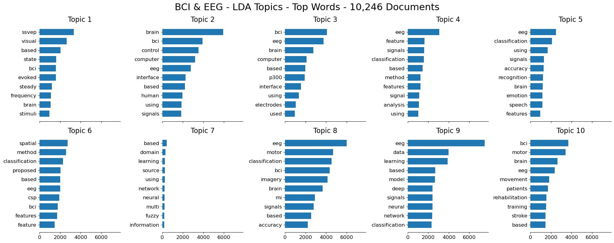

# Topic Modelling with Latent Dirichlet Allocation using Scopus Textual Corpus


>  University of Ljubljana - Doctoral Summer School 2024: Quantitative Approaches to Literature Reviews Project

- Author: Amr Mohamed - [aamrfarouqaa@gmail.com](mailto:aamrfarouqaa@gmail.com)
- Lecturer: Ivan Zupic - [i.zupic@gold.ac.uk](mailto:i.zupic@gold.ac.uk)

---

## About the Project

This project is intended for the course organized by University of Ljubljana Doctoral Summer School 2024. The course's title is the following: Quantitative Approaches to Literature Reviews (Bibliometric Methods and Topic Modeling). This project is implementing Topic Modelling using Latent Dirichlet Allocation (LDA) and Python on Scopus Textual Corpus, exploring Brain-Computer Interfaces and Electroencephalography.

---

## Description

Machine learning researchers have developed probabilistic topic modeling, a suite of algorithms that aim to discover and annotate large archives of documents with thematic information. Topic modeling algorithms are statistical methods that analyze the words of the original texts to discover the themes that run through them, how those themes are connected to each other, and how they change over time. During this work will be using the Latent Dirichlet Allocation (LDA) model. You can find more information about LDA in this [article](https://dl.acm.org/doi/pdf/10.1145/2133806.2133826).

## Preparing Development Environment

#### Technologies Stack

- Python 3.9.16
- Anaconda (conda) or venv
- Jupyter Notebook	


#### Useful Tutorials

- [Video: How To Setup & Run Jupyter Notebooks in VS Code w/ Virtual Environment & Kernels (Remote & Local)](https://youtu.be/-j6y-5t37os?si=D4P93WEo5dp1-BBK) 
- [Video: Python Conda and Jupyter Notebooks on VSCode: Quick and Easy Setup Tutorial](https://youtu.be/lGRwEcCHNtA?si=9E8mstr6PXl4XQXg) 
- [How to Install Python 3.9 with Conda: A Comprehensive Guide](https://saturncloud.io/blog/how-to-install-python-39-with-conda-a-guide-for-data-scientists/)
- [Installing the Classic Jupyter Notebook Interface](https://docs.jupyter.org/en/latest/install/notebook-classic.html) 
- [Working on Jupyter notebooks in VS Code from Virtual Conda Environment](https://medium.com/analytics-vidhya/working-on-jupyter-notebooks-in-vs-code-from-virtual-conda-environment-f415726e329d)
- [A Seamless Transition: Setting up Virtual Environment and Jupyter Notebooks in VS Code](https://medium.com/@marcio.debarros/a-seamless-transition-setting-up-virtual-environment-and-jupyter-notebooks-in-vs-code-6debf9078ddd)
- [How to Work with Python Virtual Environments, Jupyter Notebooks and VS Code](https://python.plainenglish.io/how-to-work-with-python-virtual-environments-jupyter-notebooks-and-vs-code-536fac3d93a1)
- ... there are plenty of other online tutorials, feel free to explore and choose your prefered tutorials...


#### Important Packages to Install (conda or venv)

- [sklearn](https://scikit-learn.org/stable/install.html)
- [pandas](https://pandas.pydata.org/pandas-docs/stable/getting_started/install.html) 
- [matplotlib](https://matplotlib.org/stable/install/index.html) 


## Running The Project

1. Clone this repository and download it locally,
2. Unzip it into your preferred folder,
3. Open this folder in VSCode,
4. Activate venv or conda environment,
5. Verify the installation of the packages by running the ``versionCheck.ipynb``
6. If all good, run the ``LDA_Topic_Modelling_using_Scopus.ipynb`` (otherwise check packages installation),
7. The output should show Topics extracted with their respective Vizualization Graph.

#### Two Main Parameters To Consider
- ``n_topics = 10`` - Sets the number of topics,
- ``num_top_words = 10`` - Sets the number of top-words, for each topic, to display.
- ... consider longer LDA training time if the latter has been increased ...

#### Output

##### 1. Printing the Dictionary as DataFrame (depends on the scopus dataset file): scopusLargeDataWithLinks.txt

```
                                                   title  \
0      An EEG motor imagery dataset for brain compute...   
1      Motor imagery electroencephalography channel s...   
2      Enhanced performance of EEG-based brain–comput...   
3      Self-supervised motor imagery EEG recognition ...   
4      Classification of motor imagery using chaotic ...   
...                                                  ...   
10242  New classification techniques for electroencep...   
10243  A hybrid brain-computer interface-based mail c...   
10244  Embedded prediction in feature extraction: App...   
10245  Noise reduction in brainwaves by using both EE...   
10246  Optimal EEG channel selection for motor imager...   

                                                abstract  
0      The brain-computer interface (BCI) is a techno...  
1      Electroencephalography (EEG) motor imagery (MI...  
2      Electroencephalograph (EEG) has been a reliabl...  
3      Objective. Aiming for the research on the brai...  
4      Objective. Electroencephalography (EEG) has be...  
...                                                  ...  
10242  This paper studies the state-of-the-art classi...  
10243  Brain-computer interface-based communication p...  
10244  In this study, an analysis system embedding ne...  
10245  Electroencephalogram (EEG)-based brain-compute...  
10246  A motor imagery brain-computer interface syste...  

[10247 rows x 2 columns]
```


##### 2. Display the Top Words for each Topic:


```
Topic 1:
ssvep visual based state bci evoked steady frequency brain stimuli
Topic 2:
brain bci control computer eeg interface based human using signals
Topic 3:
bci eeg brain computer based p300 interface using electrodes used
Topic 4:
eeg feature signals classification based method features signal analysis using
Topic 5:
eeg classification using signals accuracy recognition brain emotion speech features
Topic 6:
spatial method classification proposed based eeg csp bci features feature
Topic 7:
based domain learning source using network neural multi fuzzy information
Topic 8:
eeg motor classification bci imagery brain mi signals based accuracy
Topic 9:
eeg data learning based model deep signals neural network classification
Topic 10:
bci motor brain eeg movement patients rehabilitation training stroke based

```

##### 3. Visualize the Topics with their correspondent Top-Words (10x10):



---

## Using your own Scopus Corpus

#### Data Searching & Collection

- Goto [https://www.scopus.com/search/form.uri?display=basic#basic](https://www.scopus.com/search/form.uri?display=basic#basic) (Sign in with your Organization),


- Start Searching, filter your search with date of publication, specific journals, articles types... 


- Once satisfied select all the articles, with the green checkbox "All ⌄", and export as Plain Text,
- Select the following parameters: `Document title` and  `Abstract`


- Move the scopus.txt file from your downloads folder inside this project folder,
- Follow next step to preprocess the corpus.


#### Data Preprocessing

- Make a copy of `scopus.txt` as `my_scopusLargeDataWithLinks.txt` to keep original format as a backup,
- Open `my_scopusLargeDataWithLinks.txt` in VSCode (size matters for loading time),
- Type CMD+F (mac) or CTRL+F (windows), and make sure the regEx button is selected (this one: .*)


- Start applying the following 6 Steps of RegEx in VSCode to your Corpus:


1. Find `ABSTRACT:` & Replace with `ABSTRACT:::`,


2. Find `^(?!ABSTRACT)(?!https)(?!\s*$).+$` & Replace with `TITLE::: $0`,
3. Find `^(TITLE:::)` & Replace with `\n$1`,
4. Find `^.*https.*$` & Replace with `\n$&`,
5. Find `^(.*https.*)$` & Replace with `LINK::: $1`,
6. Find `©.*` & Replace with nothing (empty input text).


- Click Replace All after each step,
- Repeat the same for the other 5 regEx steps,
- Your corpus structure should align with the project's main corpus structure `scopusLargeDataWithLinks.txt`,
- You can open both side by side in VSCode and compare the structure (e.g. each title starts with `TITLE:::`, each abstract with `ABSTRACT:::` and so on...),
- Lastly, make sure your corpus starts with `2 empty lines` and ends with `3 empty lines`,
- Follow next step to model training your processed corpus named: `my_scopusLargeDataWithLinks.txt`. 

#### Model Training

1. Replace the text file name in the `open` method with your processed scopus corpus...


- Select your desired parameters, e.g. ``n_topics = 15`` and ``num_top_words = 20``
- Save the notebook,
- And click `Run All` on the top ribbon of the notebook in VSCode,
- ... the notebook will start the training, if all previous step were done appropriately, the new visualization of your topics shall be generated ...

N.B: If you want to change the suptitle of the outcome figure, you can do that in this code block (line 24):


- Congratulations, you have successfully exported your own corpus from Scopus, Preprocessed it, and Trained it with the LDA Topic Modelling algorithm. 
- Feel free to use this codebase however it is convenient to your case study, you can add more plots, modify your scopus corpus with additional parameters (i.e., document keywords...) and include them in the preprocessing phase and so on...

## License

MIT License

Copyright (c) [2024] [amrfarouqa]

Permission is hereby granted, free of charge, to any person obtaining a copy
of this software and associated documentation files (the "Software"), to deal
in the Software without restriction, including without limitation the rights
to use, copy, modify, merge, publish, distribute, sublicense, and/or sell
copies of the Software, and to permit persons to whom the Software is
furnished to do so, subject to the following conditions:

The above copyright notice and this permission notice shall be included in all
copies or substantial portions of the Software.

THE SOFTWARE IS PROVIDED "AS IS", WITHOUT WARRANTY OF ANY KIND, EXPRESS OR
IMPLIED, INCLUDING BUT NOT LIMITED TO THE WARRANTIES OF MERCHANTABILITY,
FITNESS FOR A PARTICULAR PURPOSE AND NONINFRINGEMENT. IN NO EVENT SHALL THE
AUTHORS OR COPYRIGHT HOLDERS BE LIABLE FOR ANY CLAIM, DAMAGES OR OTHER
LIABILITY, WHETHER IN AN ACTION OF CONTRACT, TORT OR OTHERWISE, ARISING FROM,
OUT OF OR IN CONNECTION WITH THE SOFTWARE OR THE USE OR OTHER DEALINGS IN THE
SOFTWARE.

---


